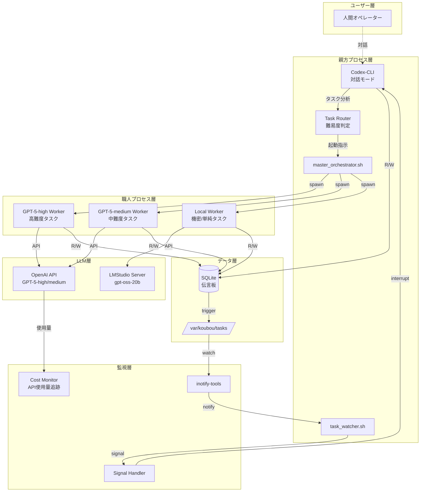
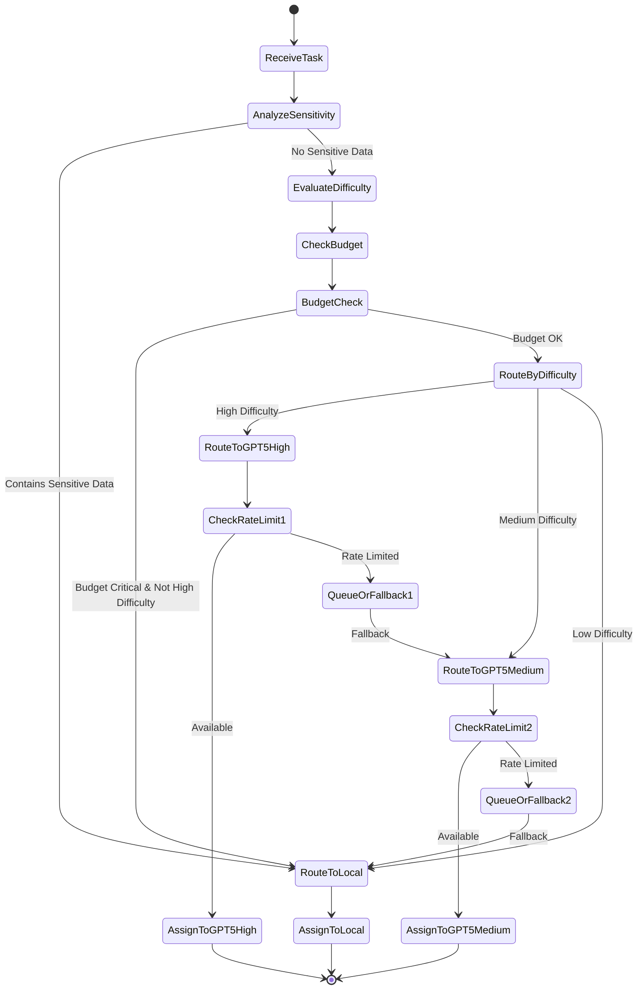

# 工房システム設計書
## Codex-CLI + GPT-5/gpt-oss-20b ハイブリッド職人実装

---

## 1. システムアーキテクチャ

### 1.1 全体構成図



### 1.2 コンポーネント構成

| コンポーネント | 実装技術 | 責務 |
|--------------|----------|------|
| 親方プロセス | Codex-CLI (対話モード) | タスク管理、人間対話、委任判断 |
| タスクルーター | Bash/Python Script | タスク難易度評価、職人選択 |
| GPT-5-high職人 | Codex-CLI + OpenAI API | 高難度タスク（設計、アーキテクチャ） |
| GPT-5-medium職人 | Codex-CLI + OpenAI API | 中難度タスク（標準コーディング） |
| ローカル職人 | Codex-CLI + LMStudio | 機密タスク、単純タスク |
| 伝言板 | SQLite3 | 状態管理、タスクキュー |
| コスト監視 | Python Script | API使用量追跡、予算管理 |

---

## 2. データ設計

### 2.1 データベーススキーマ

```sql
-- タスクマスターテーブル（拡張版）
CREATE TABLE task_master (
    task_id TEXT PRIMARY KEY,
    task_type TEXT NOT NULL CHECK(task_type IN ('code_generation', 'code_review', 'refactoring', 'testing', 'documentation', 'architecture', 'algorithm', 'general')),
    difficulty_level TEXT NOT NULL CHECK(difficulty_level IN ('high', 'medium', 'low')),
    sensitivity_level TEXT NOT NULL CHECK(sensitivity_level IN ('confidential', 'internal', 'public')),
    assigned_worker_type TEXT CHECK(assigned_worker_type IN ('gpt5_high', 'gpt5_medium', 'local')),
    status TEXT NOT NULL CHECK(status IN ('pending', 'routing', 'assigned', 'in_progress', 'completed', 'failed', 'cancelled')),
    priority INTEGER DEFAULT 5 CHECK(priority BETWEEN 1 AND 10),
    estimated_tokens INTEGER,
    actual_tokens INTEGER,
    estimated_cost REAL,
    actual_cost REAL,
    parent_task_id TEXT,
    created_at TIMESTAMP DEFAULT CURRENT_TIMESTAMP,
    updated_at TIMESTAMP DEFAULT CURRENT_TIMESTAMP,
    FOREIGN KEY (parent_task_id) REFERENCES task_master(task_id)
);

-- コスト追跡テーブル
CREATE TABLE cost_tracking (
    tracking_id INTEGER PRIMARY KEY AUTOINCREMENT,
    task_id TEXT,
    worker_type TEXT NOT NULL,
    model_name TEXT NOT NULL,
    prompt_tokens INTEGER NOT NULL,
    completion_tokens INTEGER NOT NULL,
    total_tokens INTEGER NOT NULL,
    cost_usd REAL NOT NULL,
    timestamp TIMESTAMP DEFAULT CURRENT_TIMESTAMP,
    FOREIGN KEY (task_id) REFERENCES task_master(task_id)
);

-- 月次予算管理テーブル
CREATE TABLE budget_management (
    budget_id INTEGER PRIMARY KEY AUTOINCREMENT,
    year_month TEXT NOT NULL UNIQUE,
    budget_limit_usd REAL NOT NULL,
    spent_usd REAL DEFAULT 0,
    remaining_usd REAL GENERATED ALWAYS AS (budget_limit_usd - spent_usd) STORED,
    alert_threshold_percent INTEGER DEFAULT 80,
    created_at TIMESTAMP DEFAULT CURRENT_TIMESTAMP
);

-- ワーカー管理テーブル（拡張版）
CREATE TABLE workers (
    worker_id TEXT PRIMARY KEY,
    worker_type TEXT NOT NULL CHECK(worker_type IN ('gpt5_high', 'gpt5_medium', 'local')),
    model_name TEXT NOT NULL,
    api_endpoint TEXT NOT NULL,
    process_id INTEGER,
    status TEXT NOT NULL CHECK(status IN ('idle', 'busy', 'offline', 'error', 'rate_limited')),
    capabilities JSON,
    rate_limit_remaining INTEGER,
    rate_limit_reset_at TIMESTAMP,
    last_heartbeat TIMESTAMP,
    created_at TIMESTAMP DEFAULT CURRENT_TIMESTAMP
);
```

### 2.2 タスクルーティングロジック

```python
# task_router.py
class TaskRouter:
    """タスクの難易度と機密性に基づいて適切な職人を選択"""
    
    def route_task(self, task_content: dict) -> str:
        """
        タスクを適切な職人にルーティング
        Returns: 'gpt5_high', 'gpt5_medium', or 'local'
        """
        
        # 機密性チェック
        if self._contains_sensitive_data(task_content):
            return 'local'  # 機密データは必ずローカル
        
        # 難易度評価
        difficulty = self._evaluate_difficulty(task_content)
        
        # コスト最適化チェック
        if self._is_budget_critical():
            # 予算が逼迫している場合はローカル優先
            if difficulty != 'high':
                return 'local'
        
        # 難易度に基づくルーティング
        routing_map = {
            'high': 'gpt5_high',    # アーキテクチャ設計、複雑なアルゴリズム
            'medium': 'gpt5_medium', # 標準的なコーディング、リファクタリング
            'low': 'local'          # 単純なタスク、定型処理
        }
        
        return routing_map.get(difficulty, 'local')
    
    def _contains_sensitive_data(self, task_content: dict) -> bool:
        """機密データの検出"""
        sensitive_patterns = [
            r'password', r'secret', r'api[_-]key', r'token',
            r'private[_-]key', r'credential', r'ssn', r'credit[_-]card'
        ]
        # 実装省略
        return False
    
    def _evaluate_difficulty(self, task_content: dict) -> str:
        """タスク難易度の評価"""
        indicators = {
            'high': ['architecture', 'design pattern', 'distributed', 'optimization', 'algorithm', 'concurrent', 'parallel'],
            'medium': ['refactor', 'implement', 'api', 'database', 'integration'],
            'low': ['fix', 'update', 'add comment', 'rename', 'format']
        }
        # 実装省略
        return 'medium'
```

---

## 3. インターフェース設計

### 3.1 Codex-CLI設定（職人タイプ別）

#### 3.1.1 GPT-5-high職人設定 (~/.codex/gpt5-high-config.toml)
```toml
[model]
provider = "openai"
model_name = "gpt-5-high"
api_key_env = "OPENAI_API_KEY"

[behavior]
mode = "batch"
auto_approve = true
sandbox = "workspace-write"
quiet = true

[context]
max_tokens = 128000
temperature = 0.7
top_p = 0.95

[rate_limit]
max_requests_per_minute = 10
retry_delay_seconds = 30
max_retries = 3

[output]
format = "json"
file = "/var/koubou/tasks/in_progress/{{task_id}}/output.json"
```

#### 3.1.2 GPT-5-medium職人設定 (~/.codex/gpt5-medium-config.toml)
```toml
[model]
provider = "openai"
model_name = "gpt-5-medium"
api_key_env = "OPENAI_API_KEY"

[behavior]
mode = "batch"
auto_approve = true
sandbox = "workspace-write"
quiet = true

[context]
max_tokens = 64000
temperature = 0.5
top_p = 0.9

[rate_limit]
max_requests_per_minute = 30
retry_delay_seconds = 10
max_retries = 5
```

#### 3.1.3 ローカル職人設定 (~/.codex/local-config.toml)
```toml
[model]
provider = "lmstudio"
base_url = "http://localhost:1234/v1"
model_name = "gpt-oss-20b"

[behavior]
mode = "batch"
auto_approve = true
sandbox = "workspace-write"
quiet = true

[context]
max_tokens = 8192
temperature = 0.3

[output]
format = "json"
file = "/var/koubou/tasks/in_progress/{{task_id}}/output.json"
```

### 3.2 API呼び出しラッパー

```python
# llm_connector.py
import os
import time
from typing import Dict, List
import openai
import requests

class LLMConnector:
    """統一的なLLM接続インターフェース"""
    
    def __init__(self, worker_type: str):
        self.worker_type = worker_type
        self.setup_client()
    
    def setup_client(self):
        """クライアントの初期化"""
        if self.worker_type in ['gpt5_high', 'gpt5_medium']:
            self.client = openai.OpenAI(api_key=os.getenv('OPENAI_API_KEY'))
            self.model = 'gpt-5-high' if self.worker_type == 'gpt5_high' else 'gpt-5-medium'
        else:  # local
            self.base_url = 'http://localhost:1234/v1'
            self.model = 'gpt-oss-20b'
    
    def chat_completion(self, messages: List[Dict], **kwargs) -> Dict:
        """チャット完了APIの呼び出し（レート制限対応）"""
        if self.worker_type in ['gpt5_high', 'gpt5_medium']:
            return self._openai_chat(messages, **kwargs)
        else:
            return self._local_chat(messages, **kwargs)
    
    def _openai_chat(self, messages: List[Dict], **kwargs) -> Dict:
        """OpenAI API呼び出し（コスト計算付き）"""
        max_retries = 3
        for attempt in range(max_retries):
            try:
                response = self.client.chat.completions.create(
                    model=self.model,
                    messages=messages,
                    **kwargs
                )
                
                # コスト計算
                self._log_cost(response.usage)
                return response
                
            except openai.RateLimitError:
                if attempt < max_retries - 1:
                    wait_time = 30 if self.worker_type == 'gpt5_high' else 10
                    time.sleep(wait_time)
                else:
                    raise
    
    def _log_cost(self, usage):
        """API使用コストの記録"""
        costs = {
            'gpt-5-high': 0.10,    # $0.10 per 1K tokens
            'gpt-5-medium': 0.03    # $0.03 per 1K tokens
        }
        
        total_tokens = usage.prompt_tokens + usage.completion_tokens
        cost = (total_tokens / 1000) * costs.get(self.model, 0)
        
        # SQLiteに記録
        self._save_cost_to_db(cost, usage)
```

---

## 4. プロセス設計

### 4.1 タスクルーティングフロー



### 4.2 コスト管理プロセス

```python
# cost_manager.py
class CostManager:
    """API使用コストの管理"""
    
    def __init__(self, monthly_budget: float = 100.0):
        self.monthly_budget = monthly_budget
        self.alert_threshold = 0.8  # 80%で警告
    
    def check_budget_status(self) -> dict:
        """現在の予算状況を確認"""
        current_month = datetime.now().strftime('%Y-%m')
        spent = self._get_monthly_spent(current_month)
        remaining = self.monthly_budget - spent
        
        status = {
            'month': current_month,
            'budget': self.monthly_budget,
            'spent': spent,
            'remaining': remaining,
            'percentage_used': (spent / self.monthly_budget) * 100,
            'is_critical': spent >= (self.monthly_budget * self.alert_threshold)
        }
        
        if status['is_critical']:
            self._send_budget_alert(status)
        
        return status
    
    def estimate_task_cost(self, task_type: str, estimated_tokens: int) -> float:
        """タスクのコスト見積もり"""
        rates = {
            'gpt5_high': 0.10,
            'gpt5_medium': 0.03,
            'local': 0.0
        }
        
        worker_type = self._predict_worker_type(task_type)
        rate = rates.get(worker_type, 0)
        
        return (estimated_tokens / 1000) * rate
```

---

## 5. セキュリティ設計

### 5.1 APIキー管理

```bash
#!/bin/bash
# secure_config.sh

# APIキーの暗号化保存
encrypt_api_key() {
    local api_key=$1
    echo "$api_key" | openssl enc -aes-256-cbc -salt -pass pass:$MASTER_PASSWORD -out /var/koubou/config/.api_key.enc
    chmod 600 /var/koubou/config/.api_key.enc
}

# APIキーの復号化
decrypt_api_key() {
    openssl enc -aes-256-cbc -d -salt -pass pass:$MASTER_PASSWORD -in /var/koubou/config/.api_key.enc
}

# 環境変数への設定
export_api_key() {
    export OPENAI_API_KEY=$(decrypt_api_key)
}
```

### 5.2 データ分類エンジン

```python
# data_classifier.py
import re
from typing import List, Tuple

class DataClassifier:
    """データの機密性を分類"""
    
    def __init__(self):
        self.sensitive_patterns = [
            (r'(?i)password\s*[:=]', 'credential'),
            (r'(?i)api[_-]?key\s*[:=]', 'api_key'),
            (r'(?i)secret\s*[:=]', 'secret'),
            (r'\b\d{3}-\d{2}-\d{4}\b', 'ssn'),
            (r'\b\d{4}[\s-]?\d{4}[\s-]?\d{4}[\s-]?\d{4}\b', 'credit_card'),
            (r'(?i)private[_-]?key', 'private_key'),
            (r'(?i)bearer\s+[a-zA-Z0-9\-._~+/]+=*', 'bearer_token')
        ]
    
    def classify(self, text: str) -> Tuple[str, List[str]]:
        """
        テキストの機密性を分類
        Returns: (classification, detected_patterns)
        """
        detected = []
        
        for pattern, category in self.sensitive_patterns:
            if re.search(pattern, text):
                detected.append(category)
        
        if detected:
            return ('confidential', detected)
        elif self._contains_internal_info(text):
            return ('internal', [])
        else:
            return ('public', [])
    
    def _contains_internal_info(self, text: str) -> bool:
        """内部情報の検出"""
        internal_indicators = [
            'internal', 'proprietary', 'confidential',
            'do not distribute', 'company only'
        ]
        text_lower = text.lower()
        return any(indicator in text_lower for indicator in internal_indicators)
```

---

## 6. エラー処理設計

### 6.1 レート制限対応

```python
# rate_limit_handler.py
import time
from datetime import datetime, timedelta
from typing import Optional

class RateLimitHandler:
    """APIレート制限の管理"""
    
    def __init__(self, worker_type: str):
        self.worker_type = worker_type
        self.limits = {
            'gpt5_high': {'rpm': 10, 'reset_seconds': 60},
            'gpt5_medium': {'rpm': 30, 'reset_seconds': 60}
        }
        self.request_times = []
    
    def can_make_request(self) -> bool:
        """リクエスト可能かチェック"""
        if self.worker_type not in self.limits:
            return True  # ローカルは制限なし
        
        limit = self.limits[self.worker_type]
        now = datetime.now()
        
        # 古いリクエスト記録を削除
        cutoff = now - timedelta(seconds=limit['reset_seconds'])
        self.request_times = [t for t in self.request_times if t > cutoff]
        
        return len(self.request_times) < limit['rpm']
    
    def wait_time(self) -> Optional[float]:
        """次のリクエストまでの待機時間"""
        if self.can_make_request():
            return None
        
        limit = self.limits[self.worker_type]
        oldest = min(self.request_times)
        reset_time = oldest + timedelta(seconds=limit['reset_seconds'])
        wait = (reset_time - datetime.now()).total_seconds()
        
        return max(0, wait)
    
    def record_request(self):
        """リクエストを記録"""
        self.request_times.append(datetime.now())
```

### 6.2 フォールバック戦略

```bash
#!/bin/bash
# fallback_strategy.sh

execute_with_fallback() {
    local task_id=$1
    local primary_worker=$2
    
    # プライマリワーカーで実行試行
    if try_execute_task $task_id $primary_worker; then
        echo "Task $task_id completed by $primary_worker"
        return 0
    fi
    
    # フォールバック順序
    case $primary_worker in
        "gpt5_high")
            fallback_workers=("gpt5_medium" "local")
            ;;
        "gpt5_medium")
            fallback_workers=("local")
            ;;
        *)
            echo "No fallback available for $primary_worker"
            return 1
            ;;
    esac
    
    # フォールバック実行
    for worker in "${fallback_workers[@]}"; do
        echo "Falling back to $worker for task $task_id"
        if try_execute_task $task_id $worker; then
            echo "Task $task_id completed by fallback worker $worker"
            log_fallback $task_id $primary_worker $worker
            return 0
        fi
    done
    
    echo "All fallback attempts failed for task $task_id"
    return 1
}
```

---

## 7. モニタリング設計

### 7.1 ダッシュボード仕様

```python
# dashboard.py
from flask import Flask, render_template, jsonify
import sqlite3
from datetime import datetime, timedelta

app = Flask(__name__)

@app.route('/api/status')
def get_system_status():
    """システム全体のステータス"""
    conn = sqlite3.connect('/var/koubou/db/koubou.db')
    cursor = conn.cursor()
    
    # 職人ステータス
    workers = cursor.execute("""
        SELECT worker_type, status, COUNT(*) as count
        FROM workers
        GROUP BY worker_type, status
    """).fetchall()
    
    # タスクステータス
    tasks = cursor.execute("""
        SELECT status, difficulty_level, COUNT(*) as count
        FROM task_master
        WHERE created_at > datetime('now', '-24 hours')
        GROUP BY status, difficulty_level
    """).fetchall()
    
    # コスト状況
    costs = cursor.execute("""
        SELECT 
            SUM(cost_usd) as total_cost,
            COUNT(*) as request_count,
            AVG(total_tokens) as avg_tokens
        FROM cost_tracking
        WHERE timestamp > datetime('now', '-24 hours')
    """).fetchone()
    
    # 月次予算
    budget = cursor.execute("""
        SELECT budget_limit_usd, spent_usd, remaining_usd
        FROM budget_management
        WHERE year_month = strftime('%Y-%m', 'now')
    """).fetchone()
    
    conn.close()
    
    return jsonify({
        'workers': workers,
        'tasks': tasks,
        'costs_24h': costs,
        'budget': budget,
        'timestamp': datetime.now().isoformat()
    })

@app.route('/api/metrics')
def get_metrics():
    """詳細メトリクス"""
    # 実装省略
    pass
```

---

## 8. 実装優先順位

### Phase 1: 基本機能（Week 1）
1. ローカル職人の実装とテスト
2. SQLite伝言板の構築
3. 基本的なタスクルーティング

### Phase 2: クラウド統合（Week 2）
1. OpenAI API接続実装
2. GPT-5-medium職人の実装
3. レート制限処理
4. コスト追跡機能

### Phase 3: 高度な機能（Week 3）
1. GPT-5-high職人の実装
2. 高度なタスクルーティング
3. フォールバック機構
4. 予算管理機能

### Phase 4: 監視と最適化（Week 4）
1. モニタリングダッシュボード
2. パフォーマンス最適化
3. 自動スケーリング
4. 詳細な監査ログ

---

## 改訂履歴

| 版 | 日付 | 変更内容 | 作成者 |
|----|------|----------|--------|
| 2.0 | 2024-12-29 | GPT-5統合版に更新 | AI Assistant |
| 1.0 | 2024-12-29 | 初版作成 | AI Assistant |