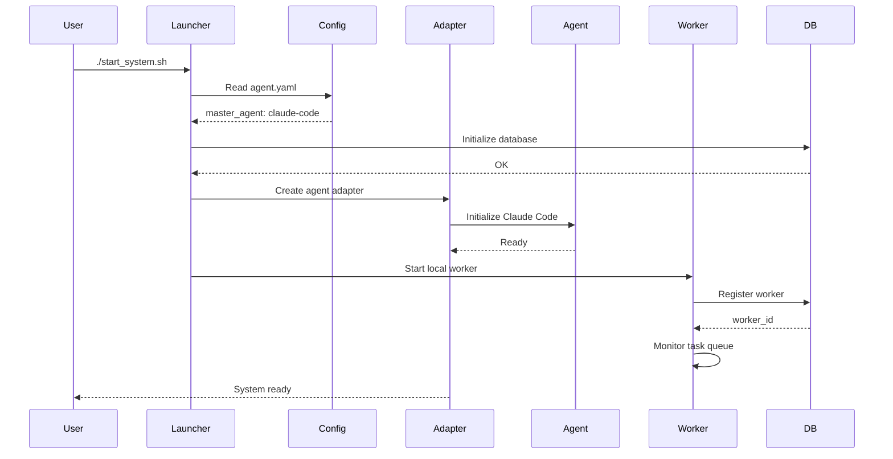
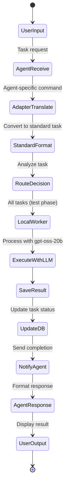

# 工房システム設計書 v2.0
## 共通基盤型AIエージェント協調システム

---

## 1. システムアーキテクチャ

### 1.1 全体構成図

```mermaid
graph TB
    subgraph "ユーザー層"
        USER[人間オペレーター]
    end
    
    subgraph "親方エージェント層"
        CLAUDE[Claude Code<br/>主要親方]
        CODEX[Codex-CLI<br/>代替親方]
        GEMINI[Gemini-CLI<br/>代替親方]
    end
    
    subgraph "共通基盤層"
        ADAPTER[Agent Adapter<br/>統一インターフェース]
        ROUTER[Task Router<br/>タスク振り分け]
        ORCHESTRATOR[master_orchestrator.py]
    end
    
    subgraph "職人プロセス層"
        WORKER_LOCAL[Local Worker<br/>gpt-oss-20b]
        WORKER_FUTURE1[Future Worker<br/>Cloud LLM #1]
        WORKER_FUTURE2[Future Worker<br/>Cloud LLM #2]
    end
    
    subgraph "LLM層"
        LMSTUDIO[LMStudio Server<br/>gpt-oss-20b]
        CLOUD_API[Future Cloud APIs<br/>(GPT-5, Gemini等)]
    end
    
    subgraph "データ層"
        DB[(SQLite<br/>伝言板)]
        FS[/var/koubou/tasks/]
    end
    
    subgraph "監視層"
        INOTIFY[inotify-tools]
        MONITOR[System Monitor]
    end
    
    USER -.->|対話| CLAUDE
    USER -.->|切替可能| CODEX
    USER -.->|切替可能| GEMINI
    
    CLAUDE -->|標準化コマンド| ADAPTER
    CODEX -->|標準化コマンド| ADAPTER
    GEMINI -->|標準化コマンド| ADAPTER
    
    ADAPTER -->|統一形式| ROUTER
    ROUTER -->|タスク分析| ORCHESTRATOR
    ORCHESTRATOR -->|spawn| WORKER_LOCAL
    ORCHESTRATOR -.->|将来| WORKER_FUTURE1
    ORCHESTRATOR -.->|将来| WORKER_FUTURE2
    
    WORKER_LOCAL -->|API| LMSTUDIO
    WORKER_FUTURE1 -.->|API| CLOUD_API
    WORKER_FUTURE2 -.->|API| CLOUD_API
    
    ADAPTER -->|R/W| DB
    WORKER_LOCAL -->|R/W| DB
    
    DB -->|trigger| FS
    FS -->|watch| INOTIFY
    INOTIFY -->|notify| MONITOR
    MONITOR -->|feedback| ADAPTER
```

### 1.2 コンポーネント構成

| コンポーネント | 実装技術 | 責務 |
|--------------|----------|------|
| 親方エージェント | Claude Code（主）/ Codex-CLI / Gemini-CLI | タスク管理、人間対話 |
| Agent Adapter | Python | エージェント固有コマンドを標準化 |
| Task Router | Python | タスク難易度・機密性判定 |
| ローカル職人 | Python + gpt-oss-20b | 全タスクの実行（実装テスト用） |
| 伝言板 | SQLite3 | 状態管理、タスクキュー |
| System Monitor | Python/Bash | プロセス監視、ヘルスチェック |

---

## 2. 共通基盤設計

### 2.1 Agent Adapter（エージェント抽象化層）

```python
# agent_adapter.py
from abc import ABC, abstractmethod
from typing import Dict, Any, Optional
import subprocess
import json

class AgentInterface(ABC):
    """全エージェントの共通インターフェース"""
    
    @abstractmethod
    def execute_task(self, task: Dict[str, Any]) -> Dict[str, Any]:
        """タスクを実行"""
        pass
    
    @abstractmethod
    def get_status(self) -> Dict[str, Any]:
        """エージェントの状態を取得"""
        pass
    
    @abstractmethod
    def delegate_task(self, task: Dict[str, Any], worker_type: str) -> str:
        """タスクを職人に委任"""
        pass

class ClaudeCodeAdapter(AgentInterface):
    """Claude Code用アダプター"""
    
    def __init__(self):
        self.agent_name = "claude-code"
        self.mcp_enabled = True
    
    def execute_task(self, task: Dict[str, Any]) -> Dict[str, Any]:
        """Claude Codeでタスクを実行"""
        # Claude CodeのMCP経由でタスク実行
        command = [
            "claude-code",
            "--task", json.dumps(task),
            "--mode", "non-interactive"
        ]
        
        result = subprocess.run(command, capture_output=True, text=True)
        return json.loads(result.stdout)
    
    def get_status(self) -> Dict[str, Any]:
        """Claude Codeの状態を取得"""
        # MCP経由で状態取得
        return {
            "agent": self.agent_name,
            "status": "active",
            "mcp_enabled": self.mcp_enabled
        }
    
    def delegate_task(self, task: Dict[str, Any], worker_type: str) -> str:
        """MCPツール経由で職人に委任"""
        # Claude CodeのMCPツールを使用して委任
        task_id = f"task_{int(time.time())}"
        self._write_to_bulletin_board(task_id, task, worker_type)
        return task_id

class CodexCLIAdapter(AgentInterface):
    """Codex-CLI用アダプター"""
    
    def __init__(self):
        self.agent_name = "codex-cli"
        self.config_path = "/var/koubou/config/codex-config.toml"
    
    def execute_task(self, task: Dict[str, Any]) -> Dict[str, Any]:
        """Codex-CLIでタスクを実行"""
        command = [
            "codex-cli",
            "--config", self.config_path,
            "--ask-for-approval", "never",
            "--output-format", "json",
            "execute", json.dumps(task)
        ]
        
        result = subprocess.run(command, capture_output=True, text=True)
        return json.loads(result.stdout)
    
    def get_status(self) -> Dict[str, Any]:
        """Codex-CLIの状態を取得"""
        return {
            "agent": self.agent_name,
            "status": "active",
            "config": self.config_path
        }
    
    def delegate_task(self, task: Dict[str, Any], worker_type: str) -> str:
        """Codex-CLIから職人に委任"""
        task_id = f"task_{int(time.time())}"
        self._write_to_bulletin_board(task_id, task, worker_type)
        return task_id

class GeminiCLIAdapter(AgentInterface):
    """Gemini-CLI用アダプター"""
    
    def __init__(self):
        self.agent_name = "gemini-cli"
    
    def execute_task(self, task: Dict[str, Any]) -> Dict[str, Any]:
        """Gemini-CLIでタスクを実行"""
        command = [
            "gemini-cli",
            "--non-interactive",
            "--json",
            task['content']
        ]
        
        result = subprocess.run(command, capture_output=True, text=True)
        return json.loads(result.stdout)
    
    def get_status(self) -> Dict[str, Any]:
        """Gemini-CLIの状態を取得"""
        return {
            "agent": self.agent_name,
            "status": "active"
        }
    
    def delegate_task(self, task: Dict[str, Any], worker_type: str) -> str:
        """Gemini-CLIから職人に委任"""
        task_id = f"task_{int(time.time())}"
        self._write_to_bulletin_board(task_id, task, worker_type)
        return task_id

class AgentFactory:
    """エージェントのファクトリークラス"""
    
    @staticmethod
    def create_agent(agent_type: str) -> AgentInterface:
        """指定されたタイプのエージェントを作成"""
        agents = {
            'claude-code': ClaudeCodeAdapter,
            'codex-cli': CodexCLIAdapter,
            'gemini-cli': GeminiCLIAdapter
        }
        
        if agent_type not in agents:
            raise ValueError(f"Unknown agent type: {agent_type}")
        
        return agents[agent_type]()
```

### 2.2 標準タスク形式

```python
# task_format.py
from dataclasses import dataclass
from typing import Optional, Dict, Any
from datetime import datetime
import json

@dataclass
class StandardTask:
    """エージェント間で共通のタスク形式"""
    
    task_id: str
    task_type: str  # 'code_generation', 'refactoring', 'testing', etc.
    priority: int  # 1-10
    content: str  # タスクの詳細内容
    context: Dict[str, Any]  # プロジェクト情報、関連ファイル等
    sensitivity_level: str  # 'confidential', 'internal', 'public'
    difficulty_level: Optional[str] = None  # 'high', 'medium', 'low'
    created_at: datetime = None
    assigned_to: Optional[str] = None
    status: str = 'pending'
    
    def __post_init__(self):
        if self.created_at is None:
            self.created_at = datetime.now()
    
    def to_json(self) -> str:
        """JSON形式に変換"""
        return json.dumps({
            'task_id': self.task_id,
            'task_type': self.task_type,
            'priority': self.priority,
            'content': self.content,
            'context': self.context,
            'sensitivity_level': self.sensitivity_level,
            'difficulty_level': self.difficulty_level,
            'created_at': self.created_at.isoformat(),
            'assigned_to': self.assigned_to,
            'status': self.status
        })
    
    @classmethod
    def from_json(cls, json_str: str) -> 'StandardTask':
        """JSON文字列から生成"""
        data = json.loads(json_str)
        data['created_at'] = datetime.fromisoformat(data['created_at'])
        return cls(**data)
    
    def to_agent_specific(self, agent_type: str) -> Dict[str, Any]:
        """エージェント固有の形式に変換"""
        base = {
            'task_id': self.task_id,
            'content': self.content,
            'priority': self.priority
        }
        
        if agent_type == 'claude-code':
            # Claude Code用の形式
            return {
                **base,
                'mcp_context': self.context,
                'tools_required': self._determine_tools()
            }
        elif agent_type == 'codex-cli':
            # Codex-CLI用の形式
            return {
                **base,
                'sandbox_mode': 'workspace-write',
                'auto_approve': True
            }
        elif agent_type == 'gemini-cli':
            # Gemini-CLI用の形式
            return {
                **base,
                'project_context': self.context
            }
        else:
            return base
    
    def _determine_tools(self) -> list:
        """必要なツールを判定"""
        tools = []
        if 'file_operations' in self.context:
            tools.append('file_manager')
        if 'git' in self.content.lower():
            tools.append('git')
        return tools
```

---

## 3. データベース設計

### 3.1 スキーマ（共通基盤対応版）

```sql
-- エージェント管理テーブル（新規）
CREATE TABLE IF NOT EXISTS agents (
    agent_id TEXT PRIMARY KEY,
    agent_type TEXT NOT NULL CHECK(agent_type IN ('claude-code', 'codex-cli', 'gemini-cli')),
    status TEXT NOT NULL CHECK(status IN ('active', 'inactive', 'error')),
    is_primary BOOLEAN DEFAULT FALSE,
    capabilities JSON,
    last_active TIMESTAMP,
    created_at TIMESTAMP DEFAULT CURRENT_TIMESTAMP
);

-- タスクマスターテーブル（更新）
CREATE TABLE IF NOT EXISTS task_master (
    task_id TEXT PRIMARY KEY,
    task_type TEXT NOT NULL,
    difficulty_level TEXT DEFAULT 'medium',
    sensitivity_level TEXT DEFAULT 'public',
    assigned_agent_id TEXT,
    assigned_worker_type TEXT,
    status TEXT NOT NULL DEFAULT 'pending',
    priority INTEGER DEFAULT 5,
    content TEXT NOT NULL,
    context JSON,
    created_by TEXT,  -- どのエージェントが作成したか
    created_at TIMESTAMP DEFAULT CURRENT_TIMESTAMP,
    updated_at TIMESTAMP DEFAULT CURRENT_TIMESTAMP,
    FOREIGN KEY (assigned_agent_id) REFERENCES agents(agent_id)
);

-- ワーカー管理テーブル（簡略化）
CREATE TABLE IF NOT EXISTS workers (
    worker_id TEXT PRIMARY KEY,
    worker_type TEXT NOT NULL DEFAULT 'local',  -- 実装テストではlocalのみ
    model_name TEXT NOT NULL DEFAULT 'gpt-oss-20b',
    api_endpoint TEXT NOT NULL,
    process_id INTEGER,
    status TEXT NOT NULL DEFAULT 'offline',
    capabilities JSON,
    last_heartbeat TIMESTAMP,
    created_at TIMESTAMP DEFAULT CURRENT_TIMESTAMP
);

-- エージェント間通信ログ（新規）
CREATE TABLE IF NOT EXISTS agent_communications (
    comm_id INTEGER PRIMARY KEY AUTOINCREMENT,
    from_agent TEXT NOT NULL,
    to_agent TEXT,
    message_type TEXT NOT NULL,
    payload JSON,
    timestamp TIMESTAMP DEFAULT CURRENT_TIMESTAMP
);
```

---

## 4. プロセス設計

### 4.1 起動シーケンス



### 4.2 タスク実行フロー



---

## 5. Claude Code統合設計

### 5.1 MCPツール定義

```python
# mcp_tools.py
"""Claude Code用のMCPツール定義"""

class KoubouMCPTools:
    """工房システム用MCPツール"""
    
    @staticmethod
    def delegate_to_worker(task_content: str, priority: int = 5) -> dict:
        """
        職人にタスクを委任
        
        MCPツール定義:
        - name: koubou_delegate_task
        - description: Delegate a task to local worker
        - parameters:
          - task_content: string (required)
          - priority: integer (optional, 1-10)
        """
        task = StandardTask(
            task_id=f"mcp_{int(time.time())}",
            task_type="delegated",
            priority=priority,
            content=task_content,
            context={},
            sensitivity_level="public"
        )
        
        # データベースに登録
        db = DatabaseHandler()
        db.create_task(task)
        
        return {
            "status": "delegated",
            "task_id": task.task_id,
            "message": f"Task delegated to local worker"
        }
    
    @staticmethod
    def get_task_status(task_id: str) -> dict:
        """
        タスクの状態を取得
        
        MCPツール定義:
        - name: koubou_get_task_status
        - description: Get status of a delegated task
        - parameters:
          - task_id: string (required)
        """
        db = DatabaseHandler()
        status = db.get_task_status(task_id)
        
        return {
            "task_id": task_id,
            "status": status.get("status", "unknown"),
            "result": status.get("result"),
            "updated_at": status.get("updated_at")
        }
    
    @staticmethod
    def list_active_tasks() -> dict:
        """
        アクティブなタスク一覧を取得
        
        MCPツール定義:
        - name: koubou_list_tasks
        - description: List all active tasks
        """
        db = DatabaseHandler()
        tasks = db.get_active_tasks()
        
        return {
            "count": len(tasks),
            "tasks": tasks
        }
```

### 5.2 Claude Code設定

```yaml
# claude_code_config.yaml
mcp_servers:
  koubou:
    command: python
    args:
      - /var/koubou/scripts/mcp_server.py
    env:
      KOUBOU_DB: /var/koubou/db/koubou.db
    
tools:
  - koubou_delegate_task
  - koubou_get_task_status
  - koubou_list_tasks

hooks:
  pre_command:
    - /var/koubou/scripts/pre_command_hook.sh
  post_command:
    - /var/koubou/scripts/post_command_hook.sh
```

---

## 6. ローカル職人実装（gpt-oss-20b）

### 6.1 ワーカー実装

```python
#!/usr/bin/env python3
# local_worker.py

import os
import sys
import json
import time
import sqlite3
import requests
from datetime import datetime
from typing import Dict, Optional

class LocalWorker:
    """gpt-oss-20bを使用するローカル職人"""
    
    def __init__(self):
        self.worker_id = f"worker_local_{int(time.time())}"
        self.model = "gpt-oss-20b"
        self.base_url = "http://localhost:1234/v1"
        self.db_path = "/var/koubou/db/koubou.db"
        self.register_worker()
    
    def register_worker(self):
        """ワーカーを登録"""
        conn = sqlite3.connect(self.db_path)
        cursor = conn.cursor()
        
        cursor.execute("""
            INSERT INTO workers (worker_id, worker_type, model_name, api_endpoint, 
                               process_id, status)
            VALUES (?, 'local', ?, ?, ?, 'idle')
        """, (self.worker_id, self.model, self.base_url, os.getpid()))
        
        conn.commit()
        conn.close()
        print(f"Worker registered: {self.worker_id}")
    
    def get_next_task(self) -> Optional[Dict]:
        """次のタスクを取得"""
        conn = sqlite3.connect(self.db_path)
        conn.row_factory = sqlite3.Row
        cursor = conn.cursor()
        
        # 実装テストフェーズ：全タスクを処理
        cursor.execute("""
            SELECT * FROM task_master
            WHERE status = 'pending'
            ORDER BY priority DESC, created_at ASC
            LIMIT 1
        """)
        
        task = cursor.fetchone()
        conn.close()
        
        return dict(task) if task else None
    
    def execute_task(self, task: Dict) -> bool:
        """タスクを実行"""
        task_id = task['task_id']
        
        try:
            # ステータス更新
            self.update_task_status(task_id, 'in_progress')
            
            # LMStudioでタスク処理
            prompt = self.build_prompt(task)
            response = self.call_lmstudio(prompt)
            
            if response:
                # 結果保存
                self.save_result(task_id, response)
                self.update_task_status(task_id, 'completed')
                return True
            else:
                self.update_task_status(task_id, 'failed')
                return False
                
        except Exception as e:
            print(f"Error executing task {task_id}: {e}")
            self.update_task_status(task_id, 'failed')
            return False
    
    def build_prompt(self, task: Dict) -> str:
        """タスク用のプロンプトを構築"""
        content = task.get('content', '')
        context = json.loads(task.get('context', '{}'))
        
        prompt = f"""You are a helpful AI assistant specialized in coding tasks.

Task Type: {task.get('task_type', 'general')}
Priority: {task.get('priority', 5)}

Task Description:
{content}

Context:
{json.dumps(context, indent=2)}

Please complete this task and provide a detailed response.
"""
        return prompt
    
    def call_lmstudio(self, prompt: str) -> Optional[str]:
        """LMStudio APIを呼び出し"""
        headers = {"Content-Type": "application/json"}
        data = {
            "model": self.model,
            "messages": [
                {"role": "system", "content": "You are a helpful coding assistant."},
                {"role": "user", "content": prompt}
            ],
            "temperature": 0.7,
            "max_tokens": 4000
        }
        
        try:
            response = requests.post(
                f"{self.base_url}/chat/completions",
                headers=headers,
                json=data,
                timeout=60
            )
            response.raise_for_status()
            
            result = response.json()
            return result['choices'][0]['message']['content']
            
        except Exception as e:
            print(f"LMStudio API error: {e}")
            return None
    
    def update_task_status(self, task_id: str, status: str):
        """タスクステータスを更新"""
        conn = sqlite3.connect(self.db_path)
        cursor = conn.cursor()
        
        cursor.execute("""
            UPDATE task_master 
            SET status = ?, assigned_worker_type = 'local', 
                updated_at = CURRENT_TIMESTAMP
            WHERE task_id = ?
        """, (status, task_id))
        
        conn.commit()
        conn.close()
    
    def save_result(self, task_id: str, content: str):
        """結果を保存"""
        output_dir = f"/var/koubou/tasks/completed"
        os.makedirs(output_dir, exist_ok=True)
        
        output_path = f"{output_dir}/{task_id}.json"
        with open(output_path, 'w') as f:
            json.dump({
                'task_id': task_id,
                'worker_id': self.worker_id,
                'model': self.model,
                'content': content,
                'timestamp': datetime.now().isoformat()
            }, f, indent=2)
    
    def run(self):
        """メインループ"""
        print(f"Starting local worker with {self.model}...")
        
        while True:
            try:
                # ハートビート更新
                self.update_heartbeat()
                
                # タスク取得と実行
                task = self.get_next_task()
                
                if task:
                    print(f"Processing task: {task['task_id']}")
                    self.update_worker_status('busy')
                    self.execute_task(task)
                    self.update_worker_status('idle')
                else:
                    time.sleep(5)
                    
            except KeyboardInterrupt:
                print("Shutting down...")
                self.update_worker_status('offline')
                break
            except Exception as e:
                print(f"Error in main loop: {e}")
                time.sleep(10)
    
    def update_heartbeat(self):
        """ハートビート更新"""
        conn = sqlite3.connect(self.db_path)
        cursor = conn.cursor()
        cursor.execute("""
            UPDATE workers 
            SET last_heartbeat = CURRENT_TIMESTAMP 
            WHERE worker_id = ?
        """, (self.worker_id,))
        conn.commit()
        conn.close()
    
    def update_worker_status(self, status: str):
        """ワーカーステータス更新"""
        conn = sqlite3.connect(self.db_path)
        cursor = conn.cursor()
        cursor.execute("""
            UPDATE workers 
            SET status = ? 
            WHERE worker_id = ?
        """, (status, self.worker_id))
        conn.commit()
        conn.close()

if __name__ == "__main__":
    worker = LocalWorker()
    worker.run()
```

---

## 7. セキュリティとエラー処理

### 7.1 エージェント切替時のセキュリティ

```python
# agent_security.py
class AgentSwitchValidator:
    """エージェント切替時のバリデーション"""
    
    @staticmethod
    def can_switch(current_agent: str, new_agent: str, 
                   active_tasks: list) -> tuple[bool, str]:
        """エージェント切替可否を判定"""
        
        # アクティブなタスクがある場合は警告
        if active_tasks:
            return False, f"Active tasks exist: {len(active_tasks)} tasks"
        
        # 同じエージェントへの切替は不要
        if current_agent == new_agent:
            return False, "Already using this agent"
        
        # サポートされているエージェントか確認
        supported = ['claude-code', 'codex-cli', 'gemini-cli']
        if new_agent not in supported:
            return False, f"Unsupported agent: {new_agent}"
        
        return True, "Switch allowed"
    
    @staticmethod
    def transfer_context(old_agent: str, new_agent: str) -> dict:
        """エージェント間でコンテキストを転送"""
        # タスク履歴、設定等を新エージェントに引き継ぎ
        context = {
            'previous_agent': old_agent,
            'transfer_time': datetime.now().isoformat(),
            'task_history': [],  # DBから取得
            'settings': {}  # 共通設定を転送
        }
        return context
```

### 7.2 エラーハンドリング

```python
# error_handler.py
class SystemErrorHandler:
    """システム全体のエラーハンドリング"""
    
    def __init__(self):
        self.db_path = "/var/koubou/db/koubou.db"
    
    def handle_agent_error(self, agent_id: str, error: Exception):
        """エージェントエラーの処理"""
        error_type = type(error).__name__
        
        if error_type == "ConnectionError":
            # 接続エラー：再接続試行
            self.retry_agent_connection(agent_id)
        elif error_type == "TimeoutError":
            # タイムアウト：代替エージェントへ切替
            self.switch_to_backup_agent(agent_id)
        else:
            # その他：ログ記録して継続
            self.log_error(agent_id, error)
    
    def handle_worker_error(self, worker_id: str, task_id: str, error: Exception):
        """ワーカーエラーの処理"""
        # タスクを再キューイング
        self.requeue_task(task_id)
        
        # ワーカーステータス更新
        self.update_worker_status(worker_id, 'error')
        
        # エラーログ記録
        self.log_error(worker_id, error)
    
    def handle_llm_error(self, error: Exception):
        """LLMエラーの処理"""
        if "rate_limit" in str(error):
            # レート制限：待機
            time.sleep(30)
        elif "context_length" in str(error):
            # コンテキスト超過：分割
            return "split_context"
        else:
            # その他：リトライ
            return "retry"
```

---

## 8. モニタリングとメトリクス

### 8.1 システムダッシュボード

```python
# dashboard.py
from flask import Flask, render_template, jsonify
import sqlite3

app = Flask(__name__)

@app.route('/api/system/status')
def get_system_status():
    """システム全体のステータス"""
    conn = sqlite3.connect('/var/koubou/db/koubou.db')
    cursor = conn.cursor()
    
    # 現在のエージェント
    cursor.execute("""
        SELECT agent_type, status 
        FROM agents 
        WHERE is_primary = TRUE
    """)
    primary_agent = cursor.fetchone()
    
    # ワーカー状態
    cursor.execute("""
        SELECT status, COUNT(*) as count
        FROM workers
        GROUP BY status
    """)
    workers = cursor.fetchall()
    
    # タスク統計
    cursor.execute("""
        SELECT status, COUNT(*) as count
        FROM task_master
        WHERE created_at > datetime('now', '-24 hours')
        GROUP BY status
    """)
    tasks = cursor.fetchall()
    
    conn.close()
    
    return jsonify({
        'primary_agent': primary_agent,
        'workers': workers,
        'task_stats_24h': tasks,
        'timestamp': datetime.now().isoformat()
    })

@app.route('/api/agent/switch', methods=['POST'])
def switch_agent():
    """エージェントを切り替え"""
    new_agent = request.json.get('agent_type')
    
    # バリデーション
    validator = AgentSwitchValidator()
    can_switch, message = validator.can_switch(
        current_agent=get_current_agent(),
        new_agent=new_agent,
        active_tasks=get_active_tasks()
    )
    
    if not can_switch:
        return jsonify({'error': message}), 400
    
    # 切替実行
    perform_agent_switch(new_agent)
    
    return jsonify({'status': 'switched', 'new_agent': new_agent})
```

---

## 9. 実装優先順位（実装テスト向け）

### Phase 1: 基本基盤（Week 1）
1. SQLiteデータベース構築
2. 標準タスク形式の実装
3. ローカル職人（gpt-oss-20b）の実装とテスト

### Phase 2: Claude Code統合（Week 2）
1. Claude Code用アダプター実装
2. MCPツール定義と登録
3. Claude Code経由でのタスク委任テスト

### Phase 3: 共通基盤完成（Week 3）
1. Agent Adapter完全実装
2. Codex-CLI、Gemini-CLI用アダプター追加
3. エージェント切替機能のテスト

### Phase 4: 運用機能（Week 4）
1. エラーハンドリング強化
2. モニタリングダッシュボード
3. ログ分析とメトリクス収集

---

## 改訂履歴

| 版 | 日付 | 変更内容 | 作成者 |
|----|------|----------|--------|
| 2.0 | 2024-12-29 | 共通基盤設計追加、Claude Code対応 | AI Assistant |
| 1.0 | 2024-12-29 | 初版作成 | AI Assistant |