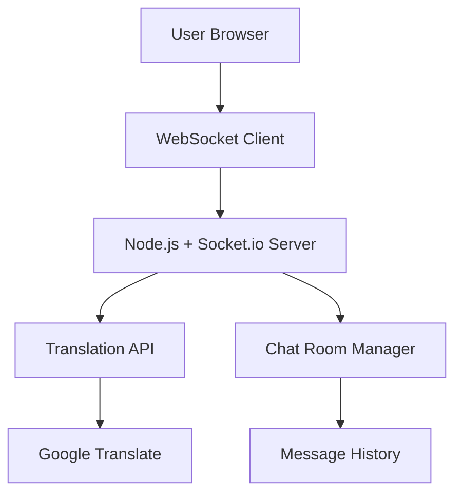

# 🏗️ リアルタイム翻訳チャット - システム設計書

## 📐 全体アーキテクチャ

## 🎯 機能要件

### WebSocketリアルタイム通信（local_001担当）
- **チャット機能**: リアルタイムメッセージ送受信
- **ルーム管理**: 複数チャットルーム対応
- **接続管理**: ユーザー接続/切断処理
- **フロントエンド**: シンプルなチャットUI

### 翻訳API（remote_lan_001担当）  
- **自動言語検出**: 入力言語の自動判定
- **多言語翻訳**: 日英中韓の相互翻訳
- **REST API**: 翻訳リクエスト/レスポンス
- **エラーハンドリング**: 翻訳失敗時の適切な処理

## 🔌 API仕様

### WebSocket Events
- `join_room` - ルーム参加
- `send_message` - メッセージ送信  
- `message_broadcast` - メッセージ配信
- `user_joined` - ユーザー参加通知

### Translation REST API
- `POST /translate` - 翻訳実行
- `GET /detect` - 言語検出
- `GET /supported` - 対応言語一覧

## 📊 データフロー

1. **ユーザー入力** → WebSocket client
2. **メッセージ送信** → Socket.io server  
3. **翻訳API呼び出し** → Python translation service
4. **翻訳結果** → 全参加者にブロードキャスト
5. **リアルタイム表示** → 各ユーザーのブラウザ

## 🚀 並列作業指示

### local_001 指示書
**出力先**: `backend/` + `frontend/`
**技術スタック**: Node.js + Express + Socket.io
**実装内容**:
- server.js (WebSocketサーバー)
- package.json (依存関係)
- index.html (チャットUI)  
- style.css (スタイリング)
- client.js (WebSocketクライアント)

### remote_lan_001 指示書
**出力先**: `translation-api/`  
**技術スタック**: Python + FastAPI + googletrans
**実装内容**:
- main.py (FastAPI翻訳サーバー)
- translator.py (翻訳ロジック)
- requirements.txt (依存関係)
- config.py (設定管理)

## ⚙️ 統合テスト計画
1. **Translation API単体テスト**
2. **WebSocketサーバー単体テスト** 
3. **統合接続テスト**
4. **複数ユーザー同時接続テスト**