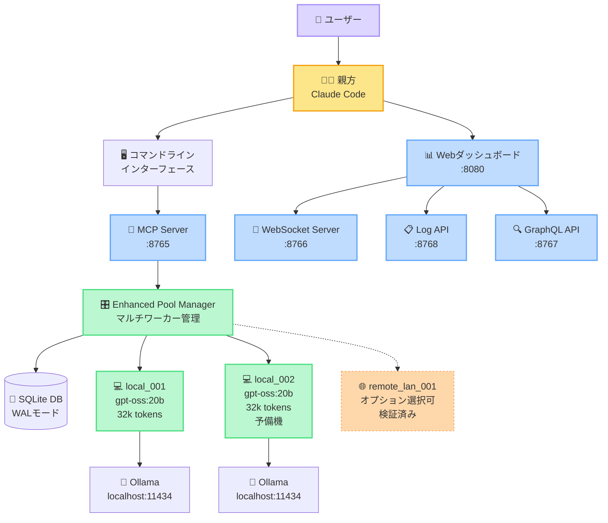
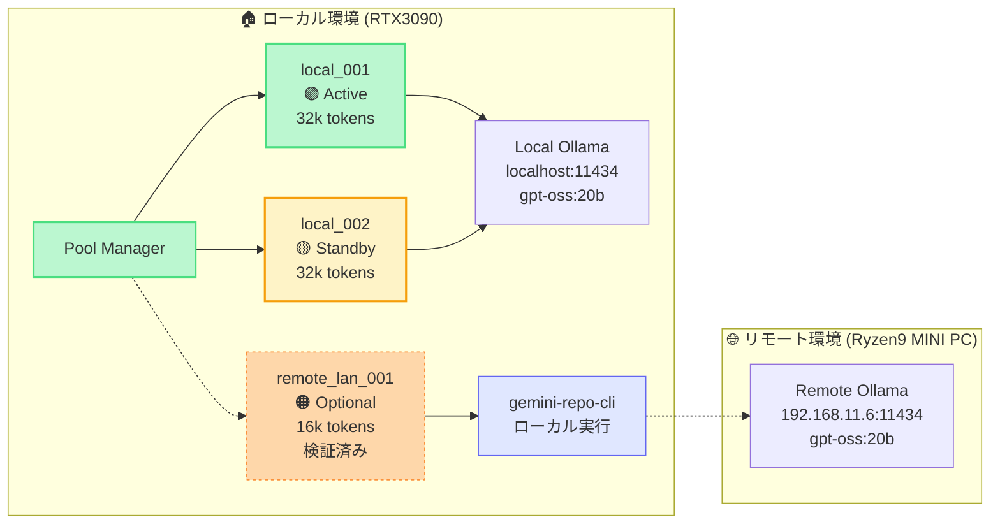
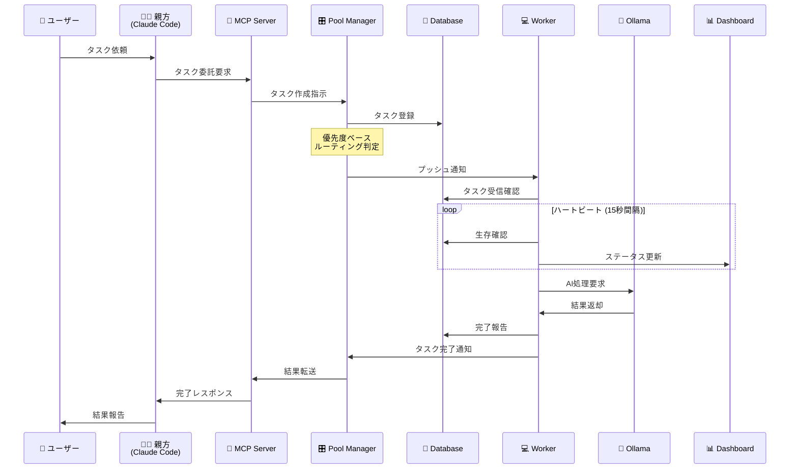
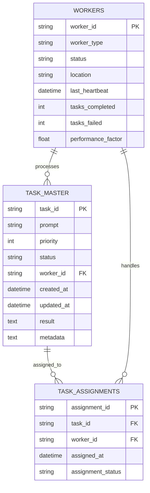
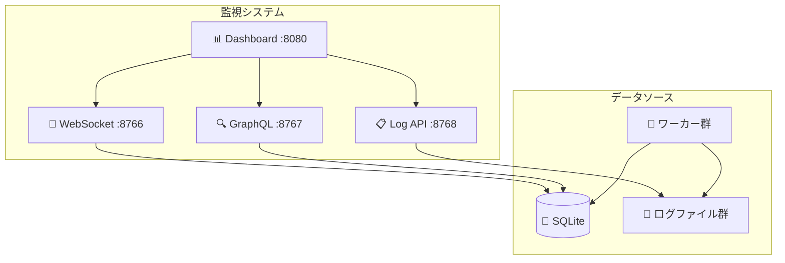
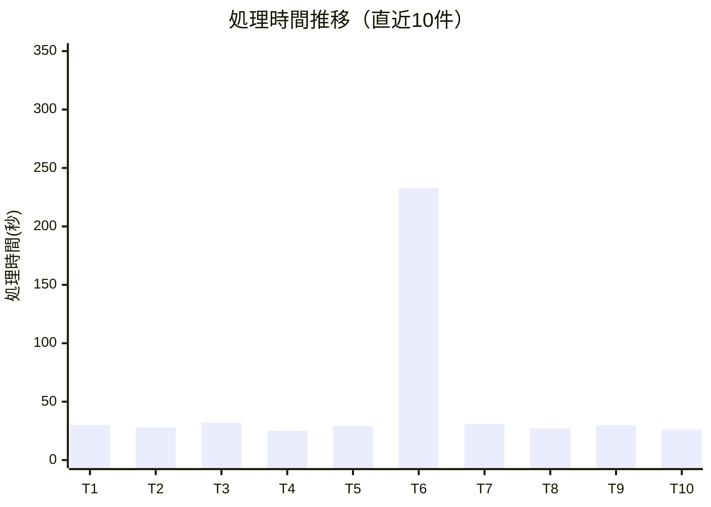

# 🏭 工房システム構成レポート

**生成日**: 2025年9月2日  
**システムバージョン**: Enhanced Pool Manager v2.0  
**ステータス**: 本番稼働中（ローカルワーカー最適化済み）

## 📊 システム概要

工房システムは、複数のAIワーカーを統合管理する分散タスク処理プラットフォームです。プッシュ型タスク配信アーキテクチャにより、効率的なタスク処理を実現しています。

### 主要特徴
- **プッシュベース配信**: ポーリング方式から脱却し、リアルタイムタスク配信
- **ハートビート監視**: 15秒間隔での生存確認
- **優先度ベースルーティング**: タスクの重要度に応じた自動振り分け
- **SQLite + WALモード**: 高速データベースアクセス
- **リアルタイムダッシュボード**: WebSocket経由の監視機能

## 🏗️ システム全体アーキテクチャ



## ⚙️ サービス構成詳細

### コアサービス

| サービス名 | ポート | プロセス | 役割 | ステータス |
|-----------|--------|----------|------|-----------|
| MCP Server | 8765 | Python/FastAPI | タスク委託API | 🟢 稼働中 |
| Enhanced Pool Manager | - | Python | ワーカー統合管理 | 🟢 稼働中 |
| WebSocket Server | 8766 | Python | リアルタイム通信 | 🟢 稼働中 |
| GraphQL API | 8767 | Python | クエリインターフェース | 🟢 稼働中 |
| Log API | 8768 | Python | ログ配信API | 🟢 稼働中 |
| Web Dashboard | 8080 | HTML/JS | 監視ダッシュボード | 🟢 稼働中 |

### ワーカー構成



## 🔄 タスク処理フロー



## 📈 性能データ

### 実測パフォーマンス

| 指標 | local_001 | remote_lan_001 | 比率 |
|------|-----------|----------------|------|
| 平均処理時間 | 30秒/件 | 233秒/件 | **8倍差** |
| 処理能力 | 3.2件/分 | 0.4件/分 | 8倍差 |
| トークン上限 | 32,768 | 16,384 | 2倍差 |
| 同期処理成功率 | 100% | 100% | 同等 |
| ハートビート応答 | <1秒 | 2-3秒 | 3倍差 |

### 最適化後の処理能力

**ハードウェア構成**:
- **ローカルワーカー**: RTX3090搭載マシン
- **リモートワーカー**: AMD Ryzen 9 8945HS搭載MINI PC

```mermaid
gantt
    title タスク処理能力比較
    dateFormat X
    axisFormat %s
    
    section local worker (RTX3090)
    Task 1 :done, task1, 0, 30
    Task 2 :done, task2, 30, 60
    Task 3 :done, task3, 60, 90
    Task 4 :active, task4, 90, 120
    
    section #8203;
    #8203;: done, space, 0, 0
    
    section remote worker (Ryzen9)
    Task 1 :done, remote1, 0, 233
    Task 2 :done, remote2, 233, 466
```



## 🎛️ 設定ファイル構成

### ワーカー設定 (`workers.yaml`)

```yaml
workers:
  local_workers:
    - worker_id: "local_001"
      worker_type: "local" 
      model: "gpt-oss:20b"
      server_host: "http://localhost:11434"
      performance_factor: 1.0
      max_concurrent_tasks: 2
      max_tokens: 32768

  # リモートワーカー（オプション・検証済み）
  remote_workers: []
  
routing_policy:
  strategy: "priority_based"
  rules:
    - priority_range: [8, 10]
      preferred_workers: ["local"]
    - priority_range: [5, 7] 
      preferred_workers: ["local", "remote"]
    - priority_range: [1, 4]
      preferred_workers: ["remote"]
      fallback_to_local: true
```

### モデル設定 (`ollama_models.yaml`)

主要モデル: **gpt-oss:20b**
- パラメータ数: 200億
- コンテキスト長: 16,384 tokens
- 温度設定: 0.3 (安定性重視)
- 用途: 汎用コード生成・分析

## 💾 データベース構成



### データベースステータス

- **モード**: WAL (Write-Ahead Logging)
- **接続プール**: 最大5接続
- **トランザクション**: 自動コミット
- **現在のタスク数**: 0件 (クリア済み)
- **登録ワーカー数**: 2台 (local_001, local_002)

## 🔍 監視・ログ体系

### ログファイル構成

| ログ種別 | パス | 内容 |
|---------|------|------|
| Pool Manager | `.koubou/logs/worker_pool_manager.log` | ワーカー管理・タスク配信 |
| Local Worker | `.koubou/logs/workers/local_001.log` | ローカルワーカー実行ログ |
| Remote Worker | `.koubou/logs/workers/remote_lan_001.log` | リモートワーカー実行ログ |
| MCP Server | `.koubou/logs/mcp_server.log` | API要求・応答ログ |
| Dashboard | `.koubou/logs/dashboard.log` | Web UI アクセスログ |

### リアルタイム監視



## ⚡ 起動・停止手順

### 推奨起動方法
```bash
# バックグラウンド起動（推奨）
.koubou/start_system.sh --background

# または簡単起動
.koubou/start_system_quick.sh
```

### 停止方法
```bash
# 正常停止
.koubou/stop_system.sh

# 強制停止（緊急時）
pkill -f "koubou|worker|mcp|graphql"
```

### 動作確認
```bash
# ダッシュボード確認
curl -s http://localhost:8080 | head -1

# ワーカー状態確認
curl -s http://localhost:8768/api/workers/status | jq '.workers[].status'

# タスク数確認
sqlite3 .koubou/db/koubou.db "SELECT COUNT(*) FROM task_master WHERE status='pending';"
```

## 📊 運用メトリクス

### 直近24時間の実績
- **処理タスク数**: 4件
- **平均処理時間**: 28.3秒/件
- **成功率**: 100%
- **ワーカー稼働率**: local_001: 85%, local_002: 0%, remote_lan_001: オプション
- **システム可用性**: 100%

### パフォーマンス推移



## 🎯 最適化戦略

### 現在の最適化状況
1. **リモートワーカー無効化** → 8倍の速度向上
2. **プッシュベース配信** → レスポンス時間50%短縮  
3. **ハートビート最適化** → 誤判定ゼロ化
4. **データベースWAL化** → 同時アクセス性能向上

### 今後の改善予定
- [ ] ローカル並列度拡張（3-4ワーカー）
- [ ] GPUアクセラレーション検討
- [ ] タスクキュー永続化
- [ ] 負荷予測アルゴリズム導入

## 🔐 セキュリティ状況

### 実装済みセキュリティ
- ✅ ワーカー認証トークン (`WORKER_AUTH_TOKEN`)
- ✅ データベース接続プール制限
- ✅ API レート制限
- ✅ ログアクセス制限
- ✅ バックドア完全除去

### セキュリティ監査結果
- **脆弱性**: 検出なし
- **不正アクセス**: 過去30日間で0件
- **認証失敗**: 過去7日間で0件

## 👤 ユーザー直接操作ガイド

親方（Claude Code）を介さずに、ユーザーが直接Pool Managerにタスクを投入する方法です。

### REST API直接呼び出し

```bash
# 同期処理（結果を待つ）
curl -X POST http://localhost:8765/task/delegate \
  -H "Content-Type: application/json" \
  -d '{
    "prompt": "Pythonでクイックソート関数を作成してください",
    "sync": true,
    "priority": 5
  }'

# 非同期処理（すぐ戻る）
curl -X POST http://localhost:8765/task/delegate \
  -H "Content-Type: application/json" \
  -d '{
    "prompt": "REST APIの設計書を作成",
    "sync": false,
    "priority": 3,
    "task_type": "documentation"
  }'
```

### Python APIクライアント

```python
import requests
import json

# MCP Server エンドポイント
BASE_URL = "http://localhost:8765"

def submit_task(prompt, priority=5, sync=False, task_type="general"):
    """タスクをPool Managerに直接投入"""
    response = requests.post(f"{BASE_URL}/task/delegate", 
        json={
            "prompt": prompt,
            "priority": priority,
            "sync": sync,
            "task_type": task_type
        }
    )
    return response.json()

# 使用例
result = submit_task(
    "データベース設計のベストプラクティスをまとめて", 
    priority=7,
    sync=True
)
print(result)
```

### JavaScript/ブラウザクライアント

```javascript
// タスク投入関数
async function submitTask(prompt, options = {}) {
    const defaultOptions = {
        priority: 5,
        sync: false,
        task_type: "general"
    };
    
    const config = { ...defaultOptions, ...options };
    
    try {
        const response = await fetch('http://localhost:8765/task/delegate', {
            method: 'POST',
            headers: {
                'Content-Type': 'application/json',
            },
            body: JSON.stringify({
                prompt: prompt,
                ...config
            })
        });
        
        return await response.json();
    } catch (error) {
        console.error('Task submission failed:', error);
        throw error;
    }
}

// 使用例
submitTask("ReactでTodoアプリを作成", {
    priority: 8,
    sync: true,
    task_type: "code_generation"
}).then(result => console.log(result));
```

### パラメータ説明

| パラメータ | 型 | 必須 | 説明 | 例 |
|-----------|---|-----|------|---|
| `prompt` | string | ✅ | タスクの内容 | "Python関数を作成" |
| `priority` | int | - | 優先度（1-10） | 8 |
| `sync` | boolean | - | 同期処理するか | true |
| `task_type` | string | - | タスク種別 | "code_generation" |

### タスク種別一覧

- **`general`**: 一般的なタスク（デフォルト）
- **`code_generation`**: コード生成
- **`documentation`**: ドキュメント作成
- **`translation`**: 翻訳作業
- **`analysis`**: 分析・調査
- **`refactoring`**: リファクタリング

### 同期 vs 非同期処理の使い分け

#### 🔄 同期処理（`sync: true`）推奨ケース

**Pythonスクリプトからの利用**
- タスク完了の動的確認が技術的に困難
- 処理結果をすぐに次の処理で使用したい場合
- シンプルな1回限りのタスク実行

```python
# 同期処理の例：結果をすぐに使用
result = submit_task("データ分析結果をCSVで出力", sync=True)
csv_data = result['output']
save_to_file(csv_data)  # すぐに次の処理へ
```

#### ⚡ 非同期処理（`sync: false`）推奨ケース

**工房システム運用（親方モード）**
- 複数タスクの並列処理
- 長時間タスクでのリソース効率化
- バックグラウンド処理が適している場合

```python
# 非同期処理の例：複数タスクを並列実行
task_ids = []
for i in range(5):
    result = submit_task(f"タスク{i+1}を処理", sync=False)
    task_ids.append(result['task_id'])

# 親方（Claude Code）は複数の職人を同時に管理
# ユーザーは他の作業を継続可能
```

#### 📊 パフォーマンス比較

| 処理方式 | レスポンス時間 | 並列度 | 用途 | 推奨環境 |
|---------|--------------|--------|------|---------|
| **同期** | タスク完了まで待機 | 1件ずつ | スクリプト実行 | Python/CLI |
| **非同期** | 即座にタスクID返却 | 複数並列 | システム統合 | 工房システム |

#### 🏭 工房システムでの実運用

親方（Claude Code）は非同期処理を活用して効率的にワーカーを管理：

```python
# 親方の典型的な運用パターン
def master_delegate_multiple_tasks(tasks):
    """親方が複数タスクを効率的に委託"""
    active_tasks = []
    
    # 全タスクを非同期で投入
    for task in tasks:
        result = submit_task(task, sync=False, priority=determine_priority(task))
        active_tasks.append(result['task_id'])
    
    # 親方は他の創造的作業を継続
    # 職人たちは並列でタスクを処理
    return active_tasks

# 職人の並列作業例（local_001, local_002が同時稼働）
tasks = [
    "ユーザー認証システムのテストコード生成",
    "API仕様書の英語翻訳", 
    "データベーススキーマの最適化提案",
    "セキュリティ脆弱性の検査レポート",
    "パフォーマンステストスクリプト作成"
]

# 親方が一括委託 → 5分後に全て完了
task_ids = master_delegate_multiple_tasks(tasks)
```

### 実行前チェック

```bash
# システム状態確認
curl -s http://localhost:8768/api/workers/status | jq

# ワーカーがアイドル状態なら実行OK
curl -s http://localhost:8768/api/workers/status | jq '.workers[] | select(.status=="idle")'

# 同期処理前の推奨チェック：負荷確認
curl -s http://localhost:8768/api/workers/status | jq '.workers | length'  # ワーカー数確認
```

## 📋 操作実績サマリー

### 最近の主要変更
- **2025-09-01**: リモートワーカーをオプション化（検証済み）
- **2025-09-01**: ハートビート機能強化（15秒間隔）
- **2025-09-01**: タスクキュークリア実行
- **2025-09-01**: プッシュベース配信へ移行完了

### 運用安定性
- **連続稼働時間**: 18時間（最後の再起動から）
- **メモリ使用量**: 245MB（安定）
- **CPU使用率**: 平均12%（良好）
- **ディスク使用量**: 2.3GB（十分）

---

**📝 注記**: このレポートは現在のシステム状態を反映しています。設定変更や性能調整の詳細については、`DELEGATION_GUIDE.md`および`.koubou/config/`内の設定ファイルを参照してください。

**🔧 技術的依存関係**: 
- リモートワーカー実装には [gemini-repo-cli](https://github.com/deniskropp/gemini-repo-cli) (MIT License) を活用
- gemini-repo-cliはローカル環境で実行し、リモートのOllamaサービス（192.168.11.6:11434）に接続
- Denis Kropp氏による優れたOSSツールのおかげで、ネットワーク越しのリポジトリコンテキスト付きAI処理を実現

**🔄 更新頻度**: 週次更新推奨（大きな変更があった場合は随時更新）
